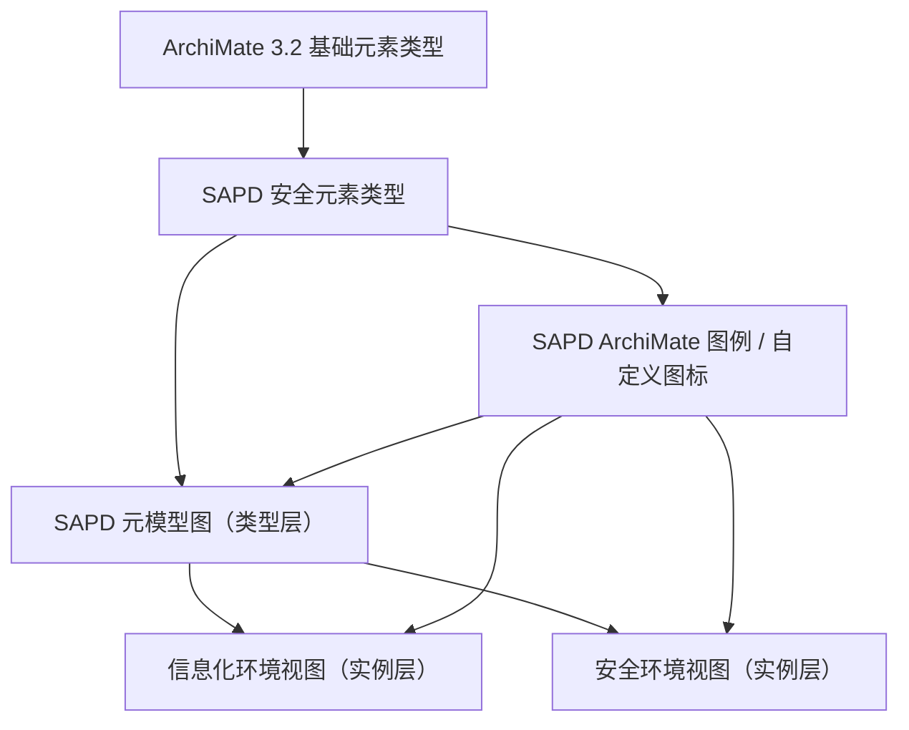

# ArchiMate 3.2 与 SAPD 信息化环境映射建模设计

日期：2026-06-02

适用页面：`/environment-mapping`，即信息化环境维度 / 信息化环境安全能力映射页面。

本文件用于明确 SAPD_Wiki 如何基于 ArchiMate 3.2 基础元素建立 SAPD 安全元素模型，并支撑元模型图、信息化环境视图和安全环境视图。本文只定义设计口径，不要求本轮修改数据库、ETL、前端代码或数据包。

当前结构化 registry：

```text
config/archimate/archimate-sapd-notation-registry.v1.json
```

当前人工审阅清单：

```text
docs/02-data-model/archimate-sapd-element-registry-v1.md
```

后续前端临时 `ARCHIMATE_NOTATION_REGISTRY` 应以该 registry 为来源逐步替换，不继续在页面中自由手写图标定义。

## 1. 设计结论

SAPD_Wiki 中的 ArchiMate 建模应分为四层：



核心判断：

- `ArchiMate 3.2 基础元素类型` 是语义基准。
- `SAPD 安全元素类型` 是从 ArchiMate 基础元素中选取、专业化和命名后的安全建模元素。
- `SAPD ArchiMate 图例 / 自定义图标` 是安全元素类型的可视化表达，不是业务环境实例。
- `SAPD 元模型图` 是类型层图，表达安全元素类型之间允许出现哪些关系。
- `信息化环境视图` 和 `安全环境视图` 是实例层图，表达某个具体环境中有哪些对象、系统、服务、边界、区域和安全组件。

## 2. 术语边界

### 2.1 ArchiMate 基础元素类型

ArchiMate 3.2 基础元素类型来自 The Open Group ArchiMate 3.2 Specification，用于提供企业架构建模的标准语义。SAPD_Wiki 当前只选择与信息化环境和安全架构视图有关的部分元素，不把 ArchiMate 全量元素一次性导入为页面主数据。

示例：

| ArchiMate 元素 | SAPD 中的典型用途 |
|---|---|
| `Capability` | 安全能力 |
| `Application Component` | 应用系统、安全系统、平台组件 |
| `Application Service` | 应用层安全服务或能力暴露 |
| `Technology Service` | 安全技术服务、基础设施服务 |
| `Technology Function` | 安全技术模块或技术能力实现 |
| `Node` | 部署节点、计算节点、逻辑节点 |
| `Device` | 安全设备、网络设备、终端设备 |
| `System Software` | 操作系统、中间件、平台软件、安全软件 |
| `Communication Network` | 网络、专线、网络域 |
| `Path` | 通信路径、访问路径、链路 |
| `Artifact` | 部署制品、配置、日志、镜像、文件 |
| `Data Object` | 应用数据对象、需要保护的数据对象 |
| `Business Object` | 业务对象、业务信息资产 |
| `Requirement` | 安全要求、策略要求、合规要求 |
| `Constraint` | 安全约束、边界条件 |
| `Principle` | 安全原则、架构原则 |

### 2.2 SAPD 安全元素类型

SAPD 安全元素类型是知识库中真正要维护的安全建模元素。它可以映射到一个或多个 ArchiMate 基础元素。

示例：

| SAPD 安全元素类型 | 推荐 ArchiMate 基准元素 | 说明 |
|---|---|---|
| 安全能力 | `Capability` | 表达组织或系统应具备的安全能力 |
| 安全作用域 | `Grouping` 或自定义 profile | 用于组织安全服务适用范围，当前项目已有 `scope_type` |
| 安全技术服务 | `Technology Service`、`Application Service` | 表达对环境对象提供的安全服务 |
| 安全技术模块 | `Technology Function`、`Application Function`、`System Software` | 表达实现安全服务的技术能力或模块 |
| 安全技术措施 | `Technology Function`、`Requirement`、`Constraint` | 表达控制措施、技术措施或约束性实现 |
| 安全系统 | `Application Component`、`Node`、`System Software` | 表达安全系统、平台或软件组件 |
| 安全设备 | `Device`、`Node` | 表达物理或虚拟安全设备 |
| 信息化环境 | `Grouping`、`Location` 或自定义 profile | 当前项目已有 `information_environment` |
| 环境子类 | `Grouping` 或自定义 profile | 当前项目已有 `environment_segment` |
| 信息化对象 | `Application Component`、`Node`、`Data Object`、`Business Object` | 当前项目已有 `information_object` |
| 网络区域 | `Grouping`、`Communication Network` | 用于 DMZ、办公网、核心区等视图 |
| 通信链路 | `Path` | 用于表达访问路径、数据流向或网络连通 |
| 保护对象 | `Data Object`、`Business Object`、`Application Component` | 用于表达安全服务保护的目标 |
| 安全策略要求 | `Requirement`、`Constraint`、`Principle` | 用于 LC-AP、标准框架或环境约束 |

### 2.3 SAPD ArchiMate 图例 / 自定义图标

draw.io 原图中的图元素，如果用于定义“某类 SAPD 安全元素应该长什么样”，应称为图例定义项或 notation，不应称为环境实例。

图例定义项保存的信息包括：

| 信息 | 说明 |
|---|---|
| `sapd_element_type_id` | 对应的 SAPD 安全元素类型 |
| `archimate_element_type_id` | 对应的 ArchiMate 基准元素 |
| `drawio_shape` | draw.io shape 名称 |
| `drawio_style` | draw.io style 字符串 |
| `icon_name` | 自定义图标名称 |
| `fill_color` | 默认填充色 |
| `stroke_color` | 默认边框色 |
| `label_rule` | 标签显示规则 |
| `source_drawio_file` | 图例来源 `.drawio` 文件 |
| `source_cell_id` | 图例来源 `mxCell` ID |

这样处理后，draw.io 图例可以继续作为样式来源，但不会和业务环境中的“某个 WAF 系统”“某个 DMZ 区”“某个业务应用”混淆。

#### 2.3.1 前端受控渲染规则

前端不得把 ArchiMate / SAPD 图例当作普通装饰图标自由绘制。所有元素图标必须先识别为 `sapd_element_type_id`，再绑定到 `archimate_element_type_id` 和 `sapd_archimate_notation` 后渲染。

受控链路：

```text
用户 / draw.io 图形
  -> 识别 sapd_element_type_id
  -> 绑定 archimate_element_type_id
  -> 匹配 sapd_archimate_notation
  -> 前端标准 renderer 渲染
```

渲染约束：

- 页面组件不得临时手写自由图形。
- 图形形状、`drawio_shape`、`appType`、`archiType`、圆角、虚线、右上角 ArchiMate 标记必须来自 notation registry。
- 元素图标中的中文标题、英文基准名、行高、字号、最大宽度和基线必须由统一 label rule 控制。
- 未登记或无法识别的 `mxCell.style` 不得渲染成标准图例，应进入 `待映射 / 非标准图例` 状态。
- D3、Cytoscape、ELK 等布局库不能替代 ArchiMate notation；它们只解决布局和连线，不决定元素语义。
- `lucide` 等通用图标库不作为 ArchiMate 3.2 标准图例来源。

### 2.4 draw.io 第一页 `图例` 的文字化识别

来源文件：

```text
data/raw-samples/drawio sample.drawio
```

来源页面：

```text
图例
```

识别结论：

- 第一页是基础元素和图例定义页。
- 第一页不是元模型图，也不是信息化环境实例图。
- 第一页可作为 `archimate_element_type`、`sapd_security_element_type` 和 `sapd_archimate_notation` 的候选来源。
- 第一页中的 `mxCell` 应优先记录为图例定义项，不写入 `sapd_environment_instance`。
- 当前第一页图例已结构化为 `config/archimate/archimate-sapd-notation-registry.v1.json`，其中 `metamodel_edges` 暂为空，等待第二页 `元模型` 更新后再补。

#### 2.4.1 图例映射清单

第一页 `图例` 的完整映射清单只维护在：

```text
docs/02-data-model/archimate-sapd-element-registry-v1.md
```

该清单包含信息化基础元素、SAPD 安全元素、安全管理元素和关系线图例的 `图例元素 -> ArchiMate 3.2 元素 -> SAPD 子类型 -> source_cell_id`。本设计文档不再重复完整表，避免 registry 文档和总体设计文档口径漂移。

#### 2.4.2 当前管理元素口径

当前 SAPD 管理元素采用以下收敛口径：

```text
组织单元 / 岗位 / 人员 = Business Actor
职能 / 角色 = Business Role
流程 / 活动 / 任务 = Business Process
```

对应关系表达为：

```text
安全工作岗位（Business Actor）
  assigned to
安全工作职能 / 角色（Business Role）
  assigned to
流程 / 活动 / 任务（Business Process）
```

这里的“角色”不是岗位和职能之外的第三类管理对象，而是 `security_work_function` 的同义业务口径。也就是说，当前版本中的 `岗位 : 角色` 与 `岗位 : 职能` 是同一组关系，均按 `1:N` 处理。

`security_authorization_role` 属于后续 RBAC 授权角色需求，不纳入当前 ArchiMate 管理元素图例。

#### 2.4.3 关系线图例

底部左侧“关系线”区域只提供线型语义说明，不代表元模型图中的具体类型关系。后续需要等元模型图更新后，再从第二页独立识别类型关系。

当前处理原则：

- 第一页关系线只作为 `sapd_archimate_notation` 的线型候选。
- 当前候选关系为 `Serving / serving_relation`、`Flow / flow_relation`、`Access / access_relation`。
- 不从第一页关系线直接生成 `sapd_metamodel_edge`。
- 元模型边必须等待更新后的元模型图，再按第二页内容独立识别。

### 2.5 元模型图

元模型图是类型层图，节点是 SAPD 安全元素类型，边是允许出现的关系类型。

元模型图回答：

- SAPD 安全元素清单中有哪些元素类型？
- 哪些元素类型之间允许建立关系？
- 这些关系对应哪些 ArchiMate relationship？
- 哪些关系会进入信息化环境映射页面？

元模型图不回答：

- 某个单位部署了哪个具体系统；
- 某个边界实际连到哪个网络区域；
- 某个产品实例部署在哪台设备上。

### 2.6 信息化环境视图与安全环境视图

信息化环境视图和安全环境视图是实例层图。

它们使用元模型图中的类型和关系约束，但节点是具体对象实例。

示例：

| 类型层 | 实例层 |
|---|---|
| 信息化环境 | 云数据中心 |
| 环境子类 | 互联网边界 |
| 信息化对象 | 互联网入口边界 |
| 安全系统 | 某 WAF 系统 |
| 安全技术服务 | Web 应用防护 |
| 安全设备 | 边界防火墙 A |
| 网络区域 | DMZ 区 |
| 通信链路 | 互联网到 DMZ 访问路径 |

## 3. 与信息化环境映射页面的关系

当前 `/environment-mapping` 已有页面主语：

```text
信息化环境 -> 环境子类 -> 信息化对象
```

当前页面已有数据链：

```text
信息化对象
  -> 安全作用域
  -> 安全技术服务
  -> 安全技术模块 / 安全技术措施
  -> 安全系统
  -> 产品
  -> 安全能力 / 安全能力关注点
```

ArchiMate / SAPD 安全元素建模进入该页面后，不应替换当前业务链路，而应为当前业务链路补充统一的类型、图例和关系约束。

建议落点：

| 当前页面对象 | SAPD 安全元素类型 | 推荐 ArchiMate 基准 |
|---|---|---|
| `information_environment` | 信息化环境 | `Grouping` 或自定义 profile |
| `environment_segment` | 环境子类 | `Grouping` 或自定义 profile |
| `information_object` | 信息化对象 | `Application Component`、`Node`、`Data Object`、`Business Object` |
| `scope_type` | 安全作用域 | `Grouping` 或自定义 profile |
| `security_technical_service` | 安全技术服务 | `Technology Service`、`Application Service` |
| `security_technology_module` | 安全技术模块 | `Technology Function`、`Application Function`、`System Software` |
| `security_technical_measure` | 安全技术措施 | `Technology Function`、`Requirement`、`Constraint` |
| `security_system` | 安全系统 | `Application Component`、`Node`、`System Software` |
| `product` | 产品 | `Artifact`、`Application Component` 或业务侧产品对象 |
| `capability` | 安全能力 | `Capability` |
| `capability_focus` | 安全能力关注点 | `Capability` 或 SAPD 自定义 profile |

## 4. 推荐数据对象

### 4.1 `archimate_element_type`

维护 ArchiMate 3.2 基础元素类型目录。

| 字段 | 说明 |
|---|---|
| `id` | 稳定 ID，如 `archimate:technology_service` |
| `archimate_version` | 固定为 `3.2` |
| `layer` | Strategy、Business、Application、Technology、Physical、Motivation、Implementation & Migration |
| `aspect` | Active Structure、Behavior、Passive Structure、Motivation 等 |
| `name_en` | 英文名称 |
| `name_zh` | 中文名称 |
| `description` | 简要说明 |
| `enabled_for_sapd` | 是否纳入 SAPD 当前建模 |

### 4.2 `sapd_security_element_type`

维护 SAPD 安全元素类型清单。

| 字段 | 说明 |
|---|---|
| `id` | 稳定 ID，如 `sapd:security_technical_service` |
| `code` | 可读编码 |
| `name` | 中文名称 |
| `description` | 业务定义 |
| `archimate_element_type_ids` | 映射到的 ArchiMate 基础元素 |
| `profile_kind` | `direct`、`specialized`、`custom_profile` |
| `page_scope` | 适用页面，如 `environment-mapping` |
| `is_security_element` | 是否进入 SAPD 安全元素清单 |
| `is_environment_instance_type` | 是否可在环境实例视图中实例化 |
| `status` | `draft`、`active`、`deprecated` |

### 4.3 `sapd_archimate_notation`

维护 SAPD 安全元素类型的图例和样式。

| 字段 | 说明 |
|---|---|
| `id` | 图例 ID |
| `sapd_element_type_id` | 对应 SAPD 安全元素类型 |
| `notation_name` | 图例名称 |
| `drawio_shape` | draw.io shape |
| `drawio_style` | draw.io style |
| `icon_ref` | 自定义图标引用 |
| `default_fill` | 默认填充色 |
| `default_stroke` | 默认边框色 |
| `label_rule` | 标签规则 |
| `source_drawio_file_id` | 来源 draw.io 文件 |
| `source_drawio_page` | 来源页面 |
| `source_cell_id` | 来源 `mxCell` |

### 4.4 `sapd_metamodel_node` 与 `sapd_metamodel_edge`

维护元模型图中的类型层节点和关系。

`sapd_metamodel_node`：

| 字段 | 说明 |
|---|---|
| `id` | 元模型节点 ID |
| `sapd_element_type_id` | 对应 SAPD 安全元素类型 |
| `notation_id` | 默认图例 |
| `group` | 元模型分组，如 环境、对象、服务、实现、能力 |
| `display_order` | 排序 |

`sapd_metamodel_edge`：

| 字段 | 说明 |
|---|---|
| `id` | 元模型边 ID |
| `source_type_id` | 起点 SAPD 安全元素类型 |
| `target_type_id` | 终点 SAPD 安全元素类型 |
| `relation_type` | SAPD 关系类型 |
| `archimate_relationship` | 对应 ArchiMate relationship，如 `serving`、`realization`、`assignment`、`composition`、`aggregation`、`flow`、`access` |
| `direction` | 展示方向 |
| `required_for_environment_page` | 是否进入 `/environment-mapping` |

### 4.5 `sapd_environment_instance` 与 `sapd_environment_relation`

维护环境实例视图中的具体节点和关系。它们使用元模型定义的类型，但自身是具体对象。

`sapd_environment_instance`：

| 字段 | 说明 |
|---|---|
| `id` | 实例 ID |
| `sapd_element_type_id` | 所属 SAPD 安全元素类型 |
| `name` | 实例名称 |
| `code` | 业务编码，可为空 |
| `environment_id` | 所属信息化环境 |
| `segment_id` | 所属环境子类 |
| `source_item_id` | 关联当前知识库对象 ID |
| `source_drawio_cell_id` | 若来自 draw.io 视图实例图，记录来源 `mxCell` |

`sapd_environment_relation`：

| 字段 | 说明 |
|---|---|
| `id` | 关系 ID |
| `source_instance_id` | 起点实例 |
| `target_instance_id` | 终点实例 |
| `metamodel_edge_id` | 对应元模型关系 |
| `relation_type` | 实例关系类型 |
| `source_evidence_id` | 来源证据 |

## 5. draw.io 文件分类与导入策略

后续接收 draw.io 原图时，必须先判断它是哪一类文件。

| draw.io 类型 | 作用 | 导入结果 |
|---|---|---|
| 图例定义图 | 定义 SAPD 安全元素类型的 ArchiMate 图例、自定义图标和样式 | 写入 `sapd_archimate_notation` |
| 元模型图 | 表达 SAPD 安全元素类型之间的关系 | 写入 `sapd_metamodel_node`、`sapd_metamodel_edge` |
| 信息化环境实例图 | 表达具体信息化环境中的对象和关系 | 写入 `sapd_environment_instance`、`sapd_environment_relation`，视图类型为 `information_environment_view` |
| 安全环境实例图 | 表达安全系统、区域、边界、设备、链路和控制关系 | 写入 `sapd_environment_instance`、`sapd_environment_relation`，视图类型为 `security_environment_view` |

导入原则：

- 图例定义图中的 `mxCell` 是图例样式样本，不是业务实例。
- 元模型图中的节点是类型节点，不是业务实例。
- 环境实例图中的节点才是具体环境对象实例。
- 如果同一个 draw.io 文件同时包含图例、元模型和实例视图，应按页面名或图层名拆分导入。
- 对 draw.io 原图只做结构化解析和来源追踪，不静默覆盖人工维护的 SAPD 安全元素定义。

## 6. 元模型图建议关系

信息化环境映射页面优先需要以下类型关系：

| 起点类型 | 关系 | 终点类型 | 推荐 ArchiMate relationship | 页面用途 |
|---|---|---|---|---|
| 信息化环境 | 包含 | 环境子类 | `composition`、`aggregation` | 左侧环境树和 E0 图 |
| 环境子类 | 包含 | 信息化对象 | `composition`、`aggregation` | 左侧环境树和 E0 / E1 图 |
| 信息化对象 | 适用 | 安全作用域 | `association` | E1 / E2 映射 |
| 安全技术服务 | 作用于 | 信息化对象 | `serving` 或 SAPD 自定义关系 | E2 对象安全服务 |
| 安全技术服务 | 支撑 | 安全能力关注点 | `realization`、`serving` | 能力反向关联 |
| 安全技术模块 | 实现 | 安全技术服务 | `realization` | 服务到模块链路 |
| 安全技术措施 | 支撑 | 安全技术服务 | `realization`、`association` | 服务到措施链路 |
| 安全技术模块 | 属于 | 安全系统 | `composition`、`aggregation` | 系统归属 |
| 安全技术模块 | 对应 | 产品 | `association` | 产品映射 |
| 安全系统 | 部署于 | 信息化环境 / 环境子类 | `assignment`、`association` | 安全环境视图 |
| 安全设备 | 位于 | 网络区域 | `assignment`、`association` | 安全环境视图 |
| 网络区域 | 连接 | 网络区域 | `flow`、`serving`、`association` | 区域拓扑 |
| 通信链路 | 连接 | 信息化对象 / 安全设备 / 网络区域 | `flow`、`association` | 访问路径 |
| 安全策略要求 | 约束 | 安全技术服务 / 安全系统 / 信息化对象 | `influence`、`association` | 后续策略约束 |

## 7. 信息化环境映射页面展示策略

现有页面的 `E0`、`E1`、`E2` 策略保持不变，ArchiMate / SAPD 安全元素模型只增强节点类型和图例。

| 层级 | 选中对象 | 使用模型 |
|---|---|---|
| `E0` | 信息化环境 | 使用 `信息化环境 -> 环境子类 -> 信息化对象` 元模型关系，只展示结构 |
| `E1` | 环境子类 | 使用对象、作用域、服务、能力概览关系，不展开模块、措施、系统和产品 |
| `E2` | 信息化对象 | 使用完整安全元素关系，展示作用域、服务、模块、措施、系统、产品、能力和关注点 |

页面不应因为引入 ArchiMate 图例而新增非业务字段展示。主展示区仍不得展示 `sheet`、`row`、`column`、`raw_value`、`source_file`、`import_id`、`source_id`、`source_ref`、`source_label`、`debug`、`raw`、`metadata`、`intermediate`、`generated_at`。

## 8. HTML 图生成策略

后续将 draw.io 转换为更好看的 HTML 时，建议不要直接使用 draw.io 导出的 HTML 作为最终页面，而是采用：

```text
draw.io 源文件
  -> 解析图例 / 元模型 / 实例图
  -> 生成 SAPD ViewModel
  -> 使用统一 HTML / CSS / SVG 渲染
```

HTML 渲染层应消费结构化 ViewModel：

| 输入 | 作用 |
|---|---|
| `sapd_security_element_type` | 决定节点语义 |
| `sapd_archimate_notation` | 决定图标、颜色、边框、标签规则 |
| `sapd_metamodel_edge` | 决定允许关系和线型 |
| `sapd_environment_instance` | 决定实例节点 |
| `sapd_environment_relation` | 决定实例边 |

这样可以做到：

- 图例统一；
- 元模型和实例图口径一致；
- 信息化环境视图和安全环境视图可以复用同一套安全元素清单；
- draw.io 保留为来源和编辑工具，HTML 成为知识库展示层。

## 9. 当前不做的事

本设计阶段暂不做：

- 不导入 ArchiMate 3.2 全量元素；
- 不改 SQLite schema；
- 不改 `environment-workbench.json`；
- 不改 `dataClient` 或 ViewModel；
- 不改 `/environment-mapping` 页面实现；
- 不把 draw.io 图例误导入为具体环境实例；
- 不把标准 / 框架控制项或管理流程从能力页反向拼接到环境页；
- 不在页面主展示区显示来源、调试或中间字段。

## 10. 后续实施顺序

建议分四步推进：

1. 用户提供 SAPD 安全元素定义和 draw.io 图例原图。
2. 建立 `ArchiMate 3.2 基础元素 -> SAPD 安全元素类型 -> SAPD 图例` 映射表。
3. 解析元模型图，形成类型层关系清单。
4. 再解析信息化环境视图和安全环境视图，形成实例层 ViewModel，并接入 `/environment-mapping`。

每一步都应保留来源追踪，包括 draw.io 文件路径、页面名、`mxCell` ID 和导入批次。

## 11. 参考来源

- The Open Group，`ArchiMate 3.2 Specification`，用于确认 ArchiMate 3.2 作为开放、独立的企业架构建模语言，并包含语言结构、通用元模型、关系、核心层、动机层、实现与迁移层、视图机制以及语言定制机制。
- 当前项目文档：`docs/04-user-guide/environment-workbench-json-spec-v1.md`
- 当前项目文档：`frontend/design-handoff/implementation-specs/environment-security-capability-graph-strategy-2026-05-20.md`
- 当前项目文档：`docs/02-data-model/data-model.md`
