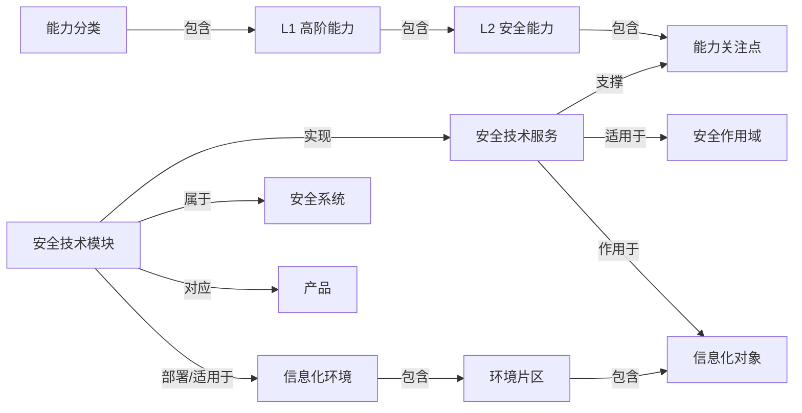

# 数据模型设计

本文档是第一版逻辑数据模型，用于把 Phase 1 的知识资产盘点、字段字典和映射规则，转成后续开发 SQLite schema 和 Excel ETL 的依据。

当前仍不写最终 SQL。原因是：现在最重要的是把“系统里有哪些对象、对象之间怎么关联、导入时怎么审查”讲清楚。等这版逻辑模型稳定后，再进入具体数据库表和迁移脚本。

## 1. 当前输入

当前权威输入：

- `docs/02-data-model/data-definition-guide.md`
- `docs/02-data-model/data-dictionary-template.md`
- `docs/02-data-model/field-dictionary-draft.md`
- `docs/02-data-model/sqlite-schema-design.md`
- `docs/03-import-etl/import-rules.md`
- `docs/03-import-etl/mapping-rules-draft.md`
- `docs/03-import-etl/remaining-21-sheets-modeling.md`
- `docs/03-import-etl/excel-import-mvp-design.md`
- `docs/03-import-etl/sample-file-inventory.md`
- `task_plan.md`

当前建模范围：

- 第一批详细建模 5 个核心 Excel Sheet。
- 剩余 21 个 Excel Sheet 已进入建模草案阶段，按流程/职能、生命周期、标准框架、目录版本分批纳入。
- 第二批已明确为 5 个 Sheet：`安全能力-安全工作`、`安全能力-安全管理元素（high level）`、`安全职能流程清单（完善L4）`、`安全工作职能清单`、`gartner工作岗位参考`。
- PPT 后续作为独立使用说明页面。
- Draw.io 后续作为只读视图展示，不考虑编辑功能。

## 2. 设计原则

| 原则 | 说明 |
|---|---|
| 先统一，再细分 | V1 不为每种对象都急着建独立表，先用统一知识对象承载，再用类型和扩展字段区分 |
| 关系是一等数据 | 能力、服务、模块、系统、产品、场景之间的映射必须作为关系保存 |
| 来源必须可追溯 | 每条对象和关系都要能回到文件、Sheet、行、列或页面 |
| 自动导入先进暂存区 | 批量导入不直接覆盖正式库，必须先预览和审查 |
| 人工编辑优先保护 | 自动更新不能静默覆盖用户人工改过的字段 |
| 原始文件继续保留 | 数据库保存结构化数据，原文件仍作为证据、附件和展示来源 |

## 3. 总体逻辑模型

```text
source_file
  └─ import_job
       ├─ staging_item
       ├─ staging_relation
       └─ review_decision

knowledge_item
  ├─ source_reference
  ├─ item_alias
  ├─ item_metadata
  └─ knowledge_relation

knowledge_relation
  └─ source_reference

guide_page
  └─ source_file(PPT)

diagram_view
  └─ source_file(Draw.io)
```

简单理解：

- `source_file` 记录原始文件。
- `import_job` 记录一次导入动作。
- `staging_*` 是导入预览区。
- `knowledge_item` 是正式知识对象。
- `knowledge_relation` 是正式关系。
- `source_reference` 负责溯源。
- `guide_page` 和 `diagram_view` 为 PPT、Draw.io 后续展示预留。

## 4. 核心实体

### 4.1 source_file 来源文件

记录每一个进入系统管理范围的原始文件。

| 字段 | 说明 |
|---|---|
| id | 系统生成 ID |
| file_name | 文件名 |
| file_type | xlsx、pptx、drawio、docx、md 等 |
| file_path | 受控相对路径或本地管理路径 |
| file_hash | 文件 hash，用于判断是否变化 |
| file_size | 文件大小 |
| usage_policy | import_source、attachment、guide、view_only 等 |
| sensitive_level | unknown、internal、public、confidential |
| created_at | 记录创建时间 |
| updated_at | 记录更新时间 |

当前样例处理：

| 文件 | usage_policy |
|---|---|
| `wiki sample.xlsx` | import_source |
| `wiki sample ppt.pptx` | guide |
| `drawio sample.drawio` | view_only |

### 4.2 import_job 导入任务

记录一次导入或重新导入。

| 字段 | 说明 |
|---|---|
| id | 系统生成 ID |
| source_file_id | 来源文件 |
| job_type | initial_import、reimport、batch_import、manual_edit |
| status | pending、parsed、reviewing、approved、rejected、failed |
| started_at | 开始时间 |
| finished_at | 完成时间 |
| summary_json | 导入摘要，如新增对象数量、错误数量 |

### 4.3 knowledge_item 知识对象

正式知识对象的统一主表。V1 建议先用这一张表承载大多数对象，通过 `type` 区分具体类型。

| 字段 | 说明 |
|---|---|
| id | 系统生成 ID |
| type | 对象类型 |
| code | 业务编号，如 `T-AS.AD-01` |
| title | 名称 |
| description | 描述 |
| category | 分类 |
| status | draft、active、deprecated |
| parent_id | 上级知识对象 |
| source_file_id | 首次来源文件 |
| source_hash | 首次来源 hash |
| metadata_json | 暂不稳定字段 |
| created_at | 创建时间 |
| updated_at | 更新时间 |

V1 对象类型：

| type | 中文名称 | 启用阶段 | 说明 |
|---|---|---|---|
| capability_category | 安全能力分类 | 是 | 如“安全技术能力 T” |
| capability_domain | L1 高阶战略能力 | 是 | 如“基础架构安全 T-AS” |
| capability | L2 安全能力 | 是 | 如“网络安全体系架构管控能力 T-AS.AD” |
| capability_focus | 安全能力关注点 | 是 | 如 `T-AS.AD-01` |
| scope_type | 安全作用域 | 是 | 如 `I-NT 网络` |
| information_environment | 信息化环境 | 是 | 如“网络周界” |
| environment_segment | 环境片区 | 是 | 如“互联网边界” |
| information_object | 信息化对象 | 是 | 如“互联网入口边界” |
| security_technical_service | 安全技术服务 | 是 | 如“网络隔离” |
| security_technology_module | 安全技术模块 | 是 | 如“网络防火墙” |
| security_system | 安全系统 | 是 | 如“网络边界安全防护” |
| product | 产品 | 是 | 第一批只保存产品名称 |
| security_work | 安全工作 | 第二批 | 能力关注点对应的安全工作内容 |
| process_domain | 流程域 | 第二批 | L1流程域 |
| process_group | 流程组 | 第二批 | L2流程组 |
| process_reference | 流程参考 | 第二批 | L3流程参考，支持结合信息化对象 |
| process_activity | 关键活动 | 第二批 | L4关键活动，允许后续补充 |
| work_function_layer | 工作职能层级 | 第二批 | 网络安全决策层、管理层、执行层、监督层 |
| work_function_group | 工作职能组 | 第二批 | 职能层级下的分组 |
| work_function | 工作职能 | 第二批 | 内部组织工作职能 |
| work_task | 工作任务 | 第二批 | 工作职能承担的具体任务 |
| gbt_42446_task_reference | GB/T 42446-2023 工作任务引用 | 第二批 | 外部标准中的工作类别和任务 |
| work_role_reference | 岗位参考 | 第二批 | Gartner 安全岗位/角色参考 |
| lifecycle_process | 生命周期过程/阶段 | 第三批 | 数据生命周期过程或应用安全开发阶段 |
| lifecycle_scene | 数据生命周期场景 | 第三批 | 数据生命周期过程下的具体场景 |
| security_activity | 安全活动 | 第三批 | 应用安全开发阶段下的安全活动 |
| security_policy_requirement | 安全策略要求 | 第三批 | 应用安全开发阶段或活动对应的策略条目 |
| software_development_type | 软件开发类型 | 第三批 | 自研、定制、外购、SaaS 等 |
| application_system_type | 应用系统类型 | 第三批 | 传统应用、微服务应用、中台类应用等 |
| application_component | 应用组件 | 第三批 | 应用系统类型下的组件层级 |
| standard_framework | 标准框架 | 后续 | ISO、CSF、等保、CIS 等 |
| standard_control | 标准控制项 | 后续 | 标准控制条目 |
| guide_section | 使用说明章节 | 后续 | 来自 PPT |
| diagram_view | 架构视图 | 后续 | 来自 Draw.io |

### 4.4 knowledge_relation 知识关系

正式关系表。任何对象之间的映射、层级、支撑关系，都不要只藏在文本字段里。

| 字段 | 说明 |
|---|---|
| id | 系统生成 ID |
| source_item_id | 起点对象 |
| target_item_id | 终点对象 |
| relation_type | 关系类型 |
| relation_label | 中文显示名 |
| confidence | exact、inferred、manual |
| source_file_id | 来源文件 |
| import_job_id | 导入任务 |
| metadata_json | 扩展信息 |
| created_at | 创建时间 |
| updated_at | 更新时间 |

关系类型：

| relation_type | 中文显示 | 起点 | 终点 |
|---|---|---|---|
| belongs_to | 属于 | 下级对象 | 上级对象 |
| supports_focus | 支撑关注点 | 安全技术服务 | 安全能力关注点 |
| applies_to_scope | 适用于作用域 | 服务/对象 | 作用域 |
| implements_service | 实现技术服务 | 安全技术模块 | 安全技术服务 |
| part_of_system | 属于安全系统 | 安全技术模块 | 安全系统 |
| maps_to_product | 对应产品 | 安全技术模块 | 产品 |
| deployed_in_environment | 部署/适用于环境 | 安全技术模块 | 信息化环境 |
| protects_object | 作用于信息化对象 | 服务/模块 | 信息化对象 |
| maps_to_work | 映射到安全工作 | 能力关注点 | 安全工作 |
| maps_to_process | 映射到流程 | L2安全能力/能力关注点 | L2流程组/L3流程参考 |
| has_activity | 包含活动 | L3流程参考 | L4关键活动 |
| stakeholder_by | 相关方为 | 能力关注点/流程参考 | 工作职能 |
| belongs_to_layer | 属于职能层级 | 工作职能/职能组 | 工作职能层级 |
| performs_task | 承担任务 | 工作职能 | 工作任务 |
| maps_to_gbt_task | 映射到 GB/T 工作任务 | 工作职能 | GB/T 42446-2023 工作任务引用 |
| references_role | 参考岗位 | 工作职能 | Gartner 岗位参考，第二批暂不自动生成 |
| has_scene | 包含场景 | 生命周期过程 | 生命周期场景 |
| maps_to_lifecycle | 映射到生命周期 | 安全技术服务/安全技术模块 | 生命周期过程 |
| requires_policy | 要求策略 | 生命周期过程/安全活动 | 安全策略要求 |
| applies_to_development_type | 适用于开发类型 | 生命周期过程/安全活动 | 软件开发类型 |
| uses_service | 使用服务 | 生命周期过程/安全活动 | 安全技术服务 |
| uses_product | 使用产品示例 | 生命周期过程/安全活动 | 产品 |
| has_component | 包含组件 | 应用系统类型 | 应用组件 |

### 4.5 source_reference 来源引用

来源引用负责回答：“这条对象或关系从哪里来的？”

| 字段 | 说明 |
|---|---|
| id | 系统生成 ID |
| target_type | item 或 relation |
| target_id | 对象 ID 或关系 ID |
| source_file_id | 来源文件 |
| source_sheet | Sheet 名 |
| source_row | 行号 |
| source_column | 列名或列号 |
| source_cell | 单元格位置 |
| raw_value | 原始值 |
| source_hash | 当时的文件 hash |

使用规则：

- 对象可以有多个来源引用。
- 关系也可以有多个来源引用。
- 重新导入时，不直接删除旧引用，而是通过 import job 和 change log 记录变化。

### 4.6 item_alias 别名

用于处理同一对象的不同写法。

| 字段 | 说明 |
|---|---|
| id | 系统生成 ID |
| item_id | 知识对象 |
| alias | 别名或原始写法 |
| alias_type | original、normalized、manual |
| source_reference_id | 来源引用 |

示例：

| item | alias |
|---|---|
| `I-US 用户` | `I_US 用户` |
| `网络防火墙` | `防火墙` |

### 4.7 staging_item 暂存对象

导入预览区的对象，等待用户审查。

| 字段 | 说明 |
|---|---|
| id | 系统生成 ID |
| import_job_id | 导入任务 |
| proposed_action | create、update、skip、conflict |
| matched_item_id | 匹配到的正式对象 |
| type | 对象类型 |
| code | 业务编号 |
| title | 名称 |
| description | 描述 |
| metadata_json | 扩展字段 |
| source_reference_json | 来源信息 |
| validation_status | ok、warning、error |
| validation_message | 校验说明 |

### 4.8 staging_relation 暂存关系

导入预览区的关系，等待用户审查。

| 字段 | 说明 |
|---|---|
| id | 系统生成 ID |
| import_job_id | 导入任务 |
| proposed_action | create、update、skip、conflict |
| matched_relation_id | 匹配到的正式关系 |
| source_item_key | 起点对象匹配键 |
| target_item_key | 终点对象匹配键 |
| relation_type | 关系类型 |
| metadata_json | 扩展字段 |
| source_reference_json | 来源信息 |
| validation_status | ok、warning、error |
| validation_message | 校验说明 |

### 4.9 review_decision 审查决策

记录用户如何处理导入预览。

| 字段 | 说明 |
|---|---|
| id | 系统生成 ID |
| import_job_id | 导入任务 |
| staging_type | item 或 relation |
| staging_id | 暂存记录 ID |
| decision | approve、reject、merge、keep_manual、needs_fix |
| note | 用户备注 |
| decided_at | 决策时间 |

### 4.10 change_log 变更记录

记录正式数据变化。

| 字段 | 说明 |
|---|---|
| id | 系统生成 ID |
| target_type | item 或 relation |
| target_id | 对象 ID 或关系 ID |
| change_type | create、update、deprecate、merge |
| before_json | 变更前 |
| after_json | 变更后 |
| import_job_id | 关联导入任务 |
| changed_at | 变更时间 |

## 5. 第一批对象关系图



## 6. 第一批 Excel 到模型的落点

| Sheet | 主要写入对象 | 主要写入关系 |
|---|---|---|
| 安全能力目录 | capability_category、capability_domain、capability、capability_focus | belongs_to |
| 安全能力作用域目录 | scope_type | 无或 belongs_to |
| 安全能力-安全技术服务 | security_technical_service、scope_type、capability_focus | supports_focus、applies_to_scope |
| 安全技术模块清单 | security_technology_module、security_system、product、security_technical_service | implements_service、part_of_system、maps_to_product |
| 作用域-安全技术服务-安全技术模块映射 | information_environment、environment_segment、information_object、scope_type、service、module、system | belongs_to、applies_to_scope、protects_object、implements_service、part_of_system、deployed_in_environment |

## 7. 页面支撑

这版逻辑模型应能支撑第一批页面。

| 页面 | 读取对象 | 读取关系 |
|---|---|---|
| 安全能力目录页 | capability_category、capability_domain、capability、capability_focus | belongs_to |
| 能力详情页 | capability、capability_focus | belongs_to、supports_focus |
| 安全技术服务页 | security_technical_service | supports_focus、applies_to_scope、implements_service |
| 安全技术模块页 | security_technology_module | implements_service、part_of_system、maps_to_product、deployed_in_environment |
| 场景映射页 | information_environment、environment_segment、information_object | belongs_to、protects_object、deployed_in_environment |
| 产品映射页 | product、security_technology_module | maps_to_product |
| 导入审查页 | staging_item、staging_relation、review_decision | 暂存记录和审查记录 |

PPT 和 Draw.io 后续页面：

| 页面 | 数据策略 |
|---|---|
| 使用说明页 | 先保存 PPT 来源文件和页级索引，后续再拆章节 |
| 架构视图页 | 先保存 Draw.io 文件和页面名，只读展示，不做编辑 |

## 8. 导出支撑

| 导出名称 | 数据来源 |
|---|---|
| 能力-关注点清单 | knowledge_item + belongs_to |
| 能力-服务映射 | capability_focus + security_technical_service + supports_focus |
| 服务-模块映射 | service + module + implements_service |
| 模块-系统-产品映射 | module + system + product + part_of_system + maps_to_product |
| 场景-服务-模块映射 | environment + object + service + module + protects_object + implements_service |
| 全量关系导出 | knowledge_relation + source_reference |
| 来源追踪导出 | source_reference + source_file |

## 9. 26 个 Sheet 的后续建模批次

完整 Excel 的 26 个 Sheet 后续都要纳入。建议按以下顺序扩展，避免一次性把模型撑散。

| 批次 | Sheet 范围 | 新增对象 |
|---|---|---|
| 第一批 | 5 个核心 Sheet | 能力、作用域、服务、模块、系统、产品、环境、对象、关系 |
| 第二批 | 安全能力-安全工作、安全能力-安全管理元素（high level）、安全职能流程清单（完善L4）、安全工作职能清单、gartner工作岗位参考 | security_work、process_domain、process_group、process_reference、process_activity、work_function_layer、work_function_group、work_function、work_task、gbt_42446_task_reference、work_role_reference |
| 第三批 | LC-DT、LC-AP 生命周期相关 Sheet | lifecycle_process、lifecycle_scene、security_activity、security_policy_requirement、software_development_type、application_system_type、application_component |
| 第四批 | 安全能力-网络安全制度、框架映射和各标准框架 Sheet | standard_framework、standard_control、policy_item |
| 第五批 | 目录、版本控制记录 | navigation_entry、source_version、release_note |

扩展原则：

- 每一批都先补字段字典，再补映射规则。
- 新对象优先复用 `knowledge_item`。
- 如果某类对象字段稳定、查询量大，再考虑独立详情表。

## 10. 后续 SQLite 设计建议

SQLite schema 设计草案详见 `docs/02-data-model/sqlite-schema-design.md`。Phase 3 进入 SQL schema 时，建议先实现这些表：

| 表 | 优先级 | 说明 |
|---|---|---|
| source_files | P0 | 来源文件 |
| import_jobs | P0 | 导入任务 |
| knowledge_items | P0 | 统一知识对象 |
| knowledge_relations | P0 | 统一关系 |
| source_references | P0 | 来源追踪 |
| staging_items | P0 | 导入对象预览 |
| staging_relations | P0 | 导入关系预览 |
| review_decisions | P1 | 审查记录 |
| change_logs | P1 | 变更记录 |
| item_aliases | P1 | 别名和标准化 |
| guide_pages | P2 | PPT 使用说明页 |
| diagram_views | P2 | Draw.io 视图 |

不建议 V1 一开始建立大量专用表。先用统一表跑通导入、搜索、详情和导出，等 26 个 Sheet 都盘清楚后，再决定哪些类型需要独立表。

## 11. 当前未决事项

| 问题 | 当前处理 |
|---|---|
| 数据是否含敏感资料 | 样例文件先按敏感处理，不提交 GitHub |
| 是否需要 Windows/macOS 双平台打包 | 后续打包阶段确认 |
| 导出最常用格式 | 先支持 CSV/JSON/Excel，后续按用户使用频率调整 |
