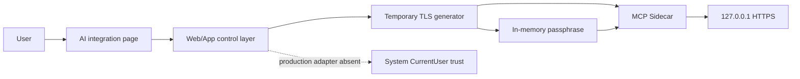
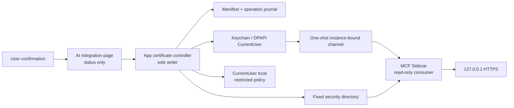
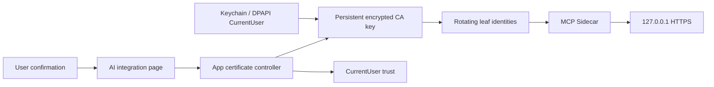
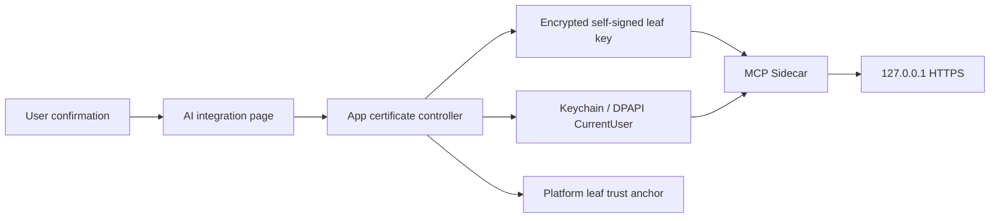

# Security Hardening Proposal: Make The App The Sole Certificate And Trust Owner

> Archive status: `completed / historical security proposal`.

## Decision

Retain the selected per-user, per-install local CA design, but make the App control plane the sole lifecycle writer and treat every certificate mutation as a crash-recoverable transaction. The CA private key remains ephemeral and is deleted after signing the loopback leaf.

## Executive Recommendation

We considered three complete options:

1. **App-owned identity with an ephemeral CA signing key** keeps the selected design and adds an ownership manifest, fixed security directory, platform secret custody, restricted CurrentUser trust, one-shot Sidecar secret delivery and a durable rotation journal.
2. **Persistent encrypted CA signing key** makes annual leaf renewal quieter, but leaves long-lived certificate-issuing authority on the device.
3. **Directly trusted self-signed leaf** removes CA signing authority, but depends on consistent non-CA trust-anchor behavior across Codex, macOS and Windows that has not yet been demonstrated.

I recommend Option 1 under the current offline, per-user and no-third-party-server constraints. It keeps the authority narrow enough to explain, preserves the already approved product direction, and turns the lifecycle gaps into explicit engineering contracts. Option 3 should remain a bounded C0 compatibility probe; it should replace Option 1 only if real target-client validation proves the same behavior on all three surfaces.

## Evidence

I inspected the current design, execution plan, TLS generator, TLS secret boundary and AI settings component at revision `e2443ac8c08e85bca3378dba51387a519a740ba1`. The current code is correctly fail-closed around production trust writes, but the durable owner, persistent identity and recovery transaction do not yet exist.

| Evidence | Finding or document | What it establishes |
|---|---|---|
| `E001` | Certificate and trust design v1 | The selected CA direction and basic lifecycle exist, while install identity, constrained trust, crash recovery and uninstall behavior required further definition. |
| `E002` | Certificate productization plan v0.3 | C0 precedes real Codex validation, but secret delivery and transaction recovery were not independent gates. |
| `E003` | Current Web Dev TLS generator | The current runtime creates a short-lived CA and leaf under a temporary root with an in-memory passphrase. |
| `E004` | TLS secret transport boundary | Encrypted PKCS#8 and unsafe-IPC rejection already exist; production trust writes intentionally remain unavailable. |
| `E005` | Current AI integration settings component | Users can control runtime and authorization, but cannot yet inspect, renew, repair or understand the certificate identity. |

Apple documents that per-user trust changes still prompt for login authentication and that passing `NULL` trust settings means always trusting a root regardless of use. Microsoft separates CurrentUser from LocalMachine stores and documents that `CRYPTPROTECT_LOCAL_MACHINE` broadens DPAPI decryption beyond one user. These platform facts support constrained User trust and user-scoped secret custody rather than silent or machine-wide installation.

## Current Design And Failure Mode

The current implementation is a development proof: the supervisor generates a temporary CA, keeps the key passphrase in memory, launches a Sidecar and removes the temporary state. That is appropriate for automated protocol tests because it leaves no system trust. It cannot become the product identity because a real client would see a different root after every restart.

The v1 design selected a durable identity but still allowed important controls to remain implicit. A directory name was standing in for ownership; “atomic rotation” did not define crash checkpoints; Sidecar secret delivery had a safety predicate but no platform mechanism; and CurrentUser trust was named without restricting the macOS trust policy or recording Windows store scope in the operation contract. These are not separate cosmetic omissions. They all come from the same structural condition: no single component yet owns the complete identity transaction across files, secrets, system trust, Sidecar startup and recovery.

That structural condition can produce predictable failure modes during implementation. A crash after installing a new root can leave an unowned trust anchor. Two App instances can race and publish different active generations. A renderer can accidentally gain too much native authority. An uninstaller can remove files but leave User trust. A downgrade can misread a newer manifest and silently regenerate identity. We should make those invalid transitions unrepresentable before writing the production adapters.

## Desired Invariants

- Exactly one App controller is the writer for one `install_id/profile`; other processes are read-only consumers or observers.
- Every trusted CA and every deletion target is bound to an App-owned manifest, generation and complete SHA-256 fingerprint.
- No private key is stored unencrypted and no key passphrase crosses argv, environment variables, ordinary files, logs or unauthenticated IPC.
- CurrentUser trust is explicit, platform-constrained where supported and never written to LocalMachine/system scope.
- A crash at any certificate operation phase deterministically resumes, rolls back or fails closed without guessing the active identity.
- Ordinary restart, port change and App upgrade preserve identity; reset, unrecoverable secret loss and explicit full rotation create a new generation.
- Browser and renderer surfaces cannot read secrets, choose certificate paths or invoke certificate-store commands.
- Reset and cleanup cannot delete a certificate that is not proven to belong to the current install/profile.

## Constraints And Non-Goals

The design must remain local and offline, bind only to `127.0.0.1`, work with Codex Streamable HTTP and use no third-party identity server. It must support Web development first, then macOS and Windows with the same user-visible contract. It does not attempt to resist an attacker who has fully controlled the same OS user session.

We are not redesigning OAuth, licensing, code signing, notarization or Authenticode. We are also not claiming that a design document changes system trust or fixes the current temporary-CA implementation.

## Before Architecture

The current boundary is useful for protocol development but stops before persistent custody and platform trust:

The important missing edge is not simply “write the CA to trust.” The missing owner must coordinate trust, secret custody, active-generation selection and Sidecar startup as one recoverable operation.

## Options

### Option 1: App-owned identity with an ephemeral CA signing key

This option preserves the selected architecture. The App generates one CA and one loopback leaf for a generation, deletes the CA private key after signing, encrypts the leaf key, stores its passphrase in Keychain or DPAPI, and records all public ownership metadata in a versioned manifest. The App is the only component that can mutate files, secrets or CurrentUser trust. A one-shot, instance-bound channel gives the expected Sidecar the passphrase only while it loads the leaf key.

The attractive part is that signing authority disappears after provisioning. Compromising the encrypted leaf identity can affect only the recorded loopback service, while compromising a persistent CA key could create additional certificates accepted by every same-user process that consumes CurrentUser roots. `pathLen:0`, loopback name constraints where compatible, restricted macOS SSL trust settings and precise fingerprint cleanup narrow this further.

The cost is that “renewal” is a full root and leaf rotation. It needs another user trust confirmation and may require clients to reconnect. We can keep that reliable by journaling every phase, validating a staged identity on a separate loopback port, switching one active-generation pointer, and retaining the old inactive generation for a bounded rollback window. Generation happens rarely, so the added cryptographic work is not on the query path; runtime memory and latency remain essentially the current TLS path plus bounded metadata.

| Change | Before | After | Security consequence | Cost |
|---|---|---|---|---|
| Lifecycle owner | Temporary supervisor and future adapters | One App certificate controller | Prevents renderer/Sidecar authority drift | New controller and native adapters |
| Identity state | Temporary files | Manifest, generations and operation journal | Makes ownership and recovery auditable | Schema and migration work |
| CA key | Exists while temporary runtime lives | Deleted immediately after leaf signing | Removes long-lived signing authority | Full trust rotation on renewal |
| Secret delivery | In-memory test provider | Keychain/DPAPI plus one-shot channel | Blocks argv/env/plain-file disclosure | Platform IPC implementation |
| Trust | No production writer | Restricted CurrentUser policy | Avoids LocalMachine and broad macOS always-trust | OS confirmation and compatibility testing |

Rollout is reversible before the first CurrentUser write: the current temporary identity remains the automated-test path. After real provisioning, rollback means restoring the previous App code while preserving the compatible manifest and secrets; it must not regenerate identity. The direct implementation must keep existing `KEY_PASSPHRASE_IPC_UNSAFE` checks as tactical protection.

### Option 2: Persistent encrypted CA signing key

This option stores both the CA signing key and leaf key encrypted under platform secret custody. The App can issue a new leaf under the same trusted root before the leaf expires, so users avoid annual root installation and clients see a stable trust anchor.

That convenience is real, especially if the product eventually renews leaf certificates frequently or operates unattended. Reliability also improves for ordinary leaf renewal because the rollback need not span two trust anchors. What gives me pause is the authority we would retain: any future defect that releases the CA key or misuses the signing API can create another certificate trusted across the current user’s system trust consumers. Name constraints help only when every target validator enforces them consistently.

The performance and memory costs are still small because signing is infrequent. The main cost is operational: CA-key backup, rotation, corruption recovery, access-control review and incident handling become permanent responsibilities. We would also need to distinguish CA-key loss from leaf-key loss and explain why a local app retains a trusted signer.

| Change | Before | After | Security consequence | Cost |
|---|---|---|---|---|
| CA authority | Temporary, then absent | Persistent encrypted signer | Reduces trust churn but increases compromise blast radius | Permanent high-value secret custody |
| Renewal | New root and leaf | New leaf under stable root | Fewer prompts and client reconnects | More complex key-loss and incident flows |
| Operations | One leaf secret | CA and leaf secret families | More recovery paths and audits | Larger testing and support matrix |

Rollback before migration is simple: do not create the persistent key. Once clients depend on the stable CA, reverting to an ephemeral CA requires a visible trust rotation. Option 2 becomes preferable only if product requirements demand unattended leaf renewal or substantially shorter leaf lifetimes and the project accepts permanent signing-key custody.

### Option 3: Directly trusted self-signed leaf

This option removes the local CA entirely. Each generation creates a self-signed loopback leaf whose public certificate is installed as a trust anchor using the platform’s leaf-trust mechanism. The App stores only the encrypted server key and the ownership manifest.

This has the smallest signing authority: there is no CA key at any point after generation and no ability to mint a second certificate under the same root. It also simplifies the public chain. The concern is compatibility, not conceptual security. macOS trust settings, Windows TrustedPeople/Root behavior, native-root adapters and Codex’s TLS stack can differ in how they treat a non-CA self-signed leaf, EKU and hostname policy. A design that works in a browser but not in Codex is not a product solution.

Resource cost is the lowest of the three options. Reliability can be excellent after compatibility is proven, but until then the cross-platform uncertainty is material. Migration from Option 1 requires replacing the trusted CA with a trusted leaf and retesting every supported client/version.

| Change | Before | After | Security consequence | Cost |
|---|---|---|---|---|
| Chain | Local CA plus leaf | One self-signed trusted leaf | Removes certificate-signing authority | Platform-specific trust semantics |
| Trust target | Root CA | Leaf trust anchor | Narrows accepted identity | Full Codex/macOS/Windows compatibility gate |
| Rotation | Replace root and leaf | Replace trusted leaf | Similar explicit user update | Client/store migration work |

This option is easy to abandon after an isolated probe because it should not mutate real trust during automated testing. It should win only when real CurrentUser experiments demonstrate equivalent trust, hostname and cleanup behavior across the target clients.

## Comparison

| Dimension | Option 1: ephemeral CA key | Option 2: persistent CA key | Option 3: trusted self-signed leaf |
|---|---|---|---|
| Security | Strong improvement; signing authority deleted, residual CurrentUser root impact | Mixed; stable trust but permanent signing authority | Potentially strongest authority minimization |
| Performance | Neutral; generation and rotation are off the query path | Neutral; leaf signing is infrequent | Neutral; simplest chain |
| Memory | Neutral; bounded manifest/journal state | Slightly higher; another protected key family | Neutral |
| Reliability | Improves with journal and rollback; annual trust rotation remains | Best routine renewal reliability; harder CA-key incident recovery | Unknown until real client compatibility passes |
| Operability | Moderate; explicit root rotation and cleanup | Highest burden; permanent signer custody and incident plan | Moderate after compatibility, high during migration |
| Migration | Incremental from current selected design | Requires changing the approved CA-key rule | Requires new trust-store and client behavior |

These directions are source-derived or hypothetical, not benchmark results. C0 should measure certificate generation duration, Sidecar startup latency and resident memory before and after the controller, although none is expected to be query-path critical. Compatibility, not performance, is the decision threshold: every supported Codex/macOS/Windows target must validate the exact chain and reconnect after rotation.

## Recommendation

I recommend Option 1. It best matches the accepted threat model and avoids keeping a trusted signer merely to save one explicit update per year. The necessary reliability work—manifest ownership, operation journal, one writer, staged validation, bounded rollback and exact cleanup—is useful under every option, so it is not throwaway effort.

Option 3 should be tested as a narrow compatibility alternative before the first production trust write. If it passes the exact current and supported future Codex clients on both operating systems, its smaller authority may justify reopening the decision. Option 2 should remain rejected unless unattended operation becomes a hard requirement.

## Evidence Coverage And Residual Risk

| Evidence | Option 1 effect | Tactical protection still required |
|---|---|---|
| `E001` — Certificate and trust design v1 | Addresses lifecycle ownership and recovery gaps | Exact fingerprint deletion, fail-closed states and user confirmation |
| `E002` — Productization plan v0.3 | Addresses omitted work-package boundaries | Authorization gates for real Keychain/DPAPI and CurrentUser writes |
| `E003` — Current Web Dev TLS generator | Replaces manual-use temporary identity with durable generations | Keep temporary CA for isolated automation only |
| `E004` — TLS secret transport boundary | Builds the platform mechanism behind the existing safety predicate | Preserve `KEY_PASSPHRASE_IPC_UNSAFE` negative tests |
| `E005` — Current AI integration settings | Adds visible state, renewal, repair and reset | Accessibility and real OS-dialog testing |

Residual risk remains:

- CurrentUser Root affects other same-user processes that consume system trust.
- A fully compromised same-user session can read or invoke the App’s available user authority.
- macOS direct App deletion can leave a public CA trust record.
- DPAPI behavior with domain roaming profiles needs real enterprise validation.
- Loopback name-constraint enforcement and directly trusted leaf behavior remain target-client compatibility questions.

## Migration And Rollout

The rollout stays Web-first:

- Freeze the manifest, state and operation schemas without system writes.
- Implement certificate generation, fixed-directory protections and fake platform adapters.
- Implement Keychain/DPAPI interfaces and one-shot secret delivery against fakes; run all unsafe-IPC negatives.
- Implement transaction recovery and UI against a fake trust adapter.
- With a separate explicit authorization, snapshot CurrentUser state and validate the real macOS Dev trust adapter.
- Connect the current Codex only after stable identity, restricted trust, recovery and UI evidence pass.
- Reuse the same contracts for macOS App and Windows Electron adapters; package only after platform UAT.

At every phase, the temporary CA remains available only to automated tests. Rollback removes the untrusted candidate implementation or restores the previous App code without rewriting an existing durable identity.

## Validation Plan

- Run JSON Schema positive/negative fixtures for every state, reason and operation phase.
- Verify permissions, symlink/hardlink/reparse rejection, same-volume atomic switch and schema downgrade refusal.
- Kill the controller after every journal phase and verify deterministic recovery.
- Test duplicate CN/different fingerprint, missing trust, missing secret, clock rollback, expired leaf and corrupted manifest.
- Prove no passphrase appears in argv, environment, logs, ordinary files, frontend state or diagnostics.
- Test wrong-user, wrong-process, wrong-generation, wide-ACL and repeated-read secret transport.
- Snapshot CurrentUser and LocalMachine stores before and after every authorized platform test.
- Validate macOS restricted SSL trust settings and refusal of `NULL` always-trust.
- Validate Windows `CurrentUser\Root`, DPAPI CurrentUser and renderer isolation.
- Test current Codex, supported Codex versions, App restart, MCP restart, port change and certificate rotation.
- Exercise keyboard, focus, aria-live, narrow layout and 200% zoom on first enable, renew, repair, conflict, recovery and reset.

## Implementation Work Packages

The selected option maps to the ordered C0 work packages in `docs/06-implementation/local-mcp-certificate-productization-and-client-validation-plan-v0.4.md`:

- C0-1 schema and ownership manifest;
- C0-2 certificate and secure-directory core;
- C0-3 platform secret custody and Sidecar transport;
- C0-4 restricted CurrentUser trust adapters;
- C0-5 transaction recovery, upgrade and uninstall;
- C0-6 product UI and status;
- C0-7 lifecycle and real-client validation.

Each real system-trust mutation, real client configuration and packaging step remains separately authorized.

## Open Questions

- Do all target Codex/macOS/Windows validators accept a critical IP `nameConstraints` extension restricted to `127.0.0.1/32`?
- Can a directly trusted self-signed leaf deliver equivalent behavior across all target client versions?
- Does the macOS product need MCP access while the device is locked after first unlock, or is `WhenUnlockedThisDeviceOnly` sufficient?
- Which Windows enterprise/domain profile combinations must be included in the DPAPI device-binding matrix?
- Is the default 24-hour inactive rollback window acceptable, or should cleanup wait only for known client reconnection plus explicit confirmation?
